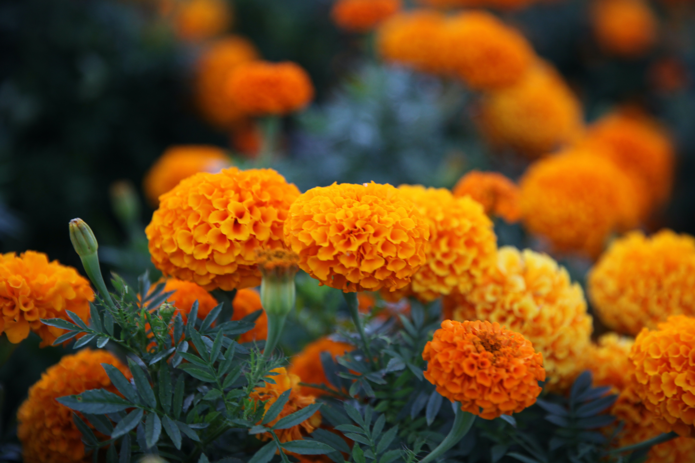

<body style="background-color: #bed6c5">

 An Image Recognition Model 

<a style="text-align:right" href="https://lubnaonline228.github.io/flower-recognizer/flower_recognizer.html"><button class="button-1"> Start </button></a>
 

 

 
 

 

 
  

 This application can classify 10 Different Types of Flowers, like:   
Beli  
Gada  
Joba  
Kamini  
Kodom  
Palash  
Rose  
Sheuli  
Sunflower  
Water Lily  

</body>

<!-- HTML !-->
<button class="button-1" role="button">Button 1</button>

